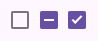

# MdCheckboxComponent (Checkbox)

`MdCheckboxComponent` is a custom LitElement representing a material design checkbox.

> _Checkboxes let users select one or more items from a list, or turn an item on or off_

- Use checkboxes (instead of switches or radio buttons) if multiple options can be selected from a list
- Label should be scannable
- Selected items are more prominent than unselected items

## Usage

Use checkboxes to:

- Select one or more options from a list
- Present a list containing sub-selections
- Turn an item on or off in a desktop environment
- Visually group similar options together

`1` Unselected, `2` Indeterminate, `3` Selected



## Properties

| Property        | Type    | Default | Description                                         |
| --------------- | ------- | ------- | --------------------------------------------------- |
| `name`          | String  | -       | The name attribute of the checkbox.                 |
| `indeterminate` | Boolean | -       | Represents the indeterminate state of the checkbox. |
| `checked`       | Boolean | -       | Represents the checked state of the checkbox.       |

## Instance Methods

- `checkboxNative`: Returns the native checkbox input element.
- `checkboxTrack`: Returns the track element of the checkbox.
- `checkboxThumb`: Returns the thumb element of the checkbox.

## Events

- `onCheckboxNativeInput`: Triggered when the native checkbox input changes.

## Examples

Checkboxes should be used instead of switches if multiple, related options can be selected from a list. Checkboxes visually group similar items effectively and take up less space than switches.

- Unselected

```html
<md-checkbox></md-checkbox>
```

- Indeterminate

```html
<md-checkbox indeterminate></md-checkbox>
```

- Selected

```html
<md-checkbox checked></md-checkbox>
```
