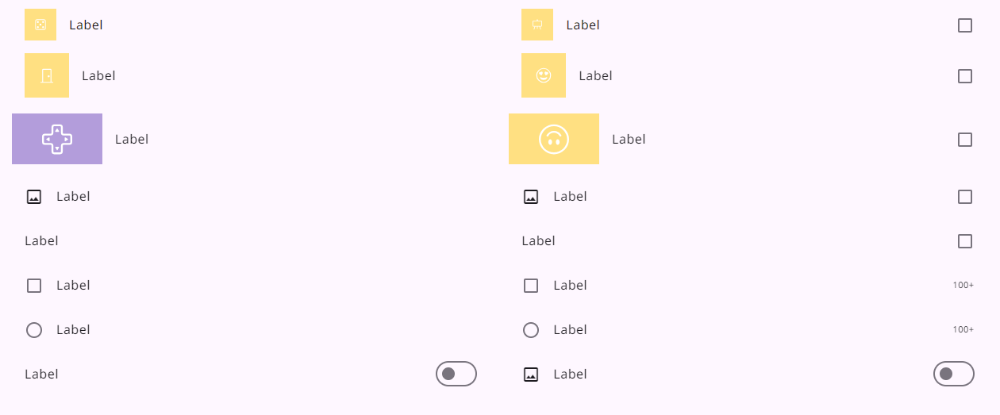
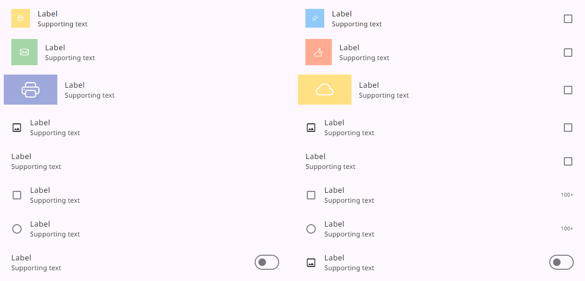
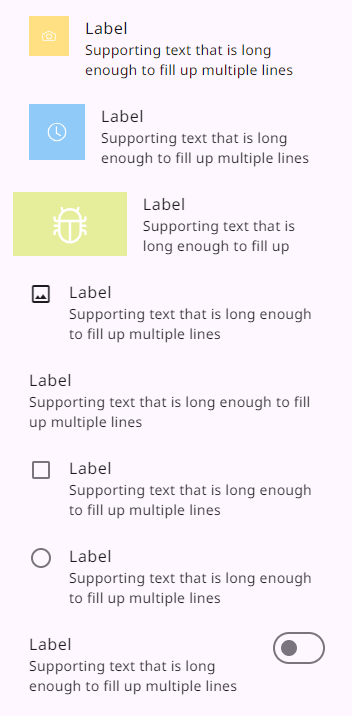

# Lists

> _Lists are continuous, vertical indexes of text and images_

- Use lists to help users find a specific item and act on it
- Order list items in logical ways (like alphabetical or numerical)
- Three sizes: one-line, two-line, and three-line
- Keep items short and easy to scan
- Show icons, text, and actions in a consistent format

# Usage

Lists are vertically organized groups of text and images.

Optimized for reading comprehension, a list consists of a single continuous column of rows, with each row representing a list item.

List items can contain primary and supplemental actions represented by icons and text.

- One line

  

- Two line

  

- Three line

  

<hr>

# MdListItemComponent

`MdListItemComponent` is a custom LitElement representing a material design list item.

## Properties

| Property         | Type    | Default | Description                                                                                     |
| ---------------- | ------- | ------- | ----------------------------------------------------------------------------------------------- |
| label            | String  |         | The label text for the list item.                                                               |
| supportingText   | String  |         | Supporting text for additional information.                                                     |
| badge            | String  |         | The badge text for the list item.                                                               |
| leadingItems     | Array   | [ ]     | Array of leading items. Each item is an object with properties like `item`, `src`, `alt`, etc.  |
| trailingItems    | Array   | [ ]     | Array of trailing items. Each item is an object with properties like `item`, `src`, `alt`, etc. |
| activated        | Boolean | false   | Reflects whether the list item is activated or not.                                             |
| expanded         | Boolean | -       | Reflects the expansion state of the item.                                                       |
| collapsibleIcons | Array   | -       | Icons for collapsible items.                                                                    |
| nodeIcons        | Array   | -       | Icons for tree nodes.                                                                           |
| leafIcon         | String  | -       | Icon for tree leaves.                                                                           |

## Instance Methods

None

## Events

None

## Examples

```html
<md-list-item
  label="Item 1"
  supportingText="Additional information"
></md-list-item>
```

<hr>

# MdListRowComponent

`MdListRowComponent` is a custom LitElement representing a row within a material design list.

## Properties

No specific properties are defined.

## Instance Methods

None

## Events

None

## Examples

```html
<md-list-row></md-list-row>
```

<hr>

# MdListComponent

`MdListComponent` is a custom LitElement representing a material design list.

## Properties

| Property  | Type    | Default | Description                                                         |
| --------- | ------- | ------- | ------------------------------------------------------------------- |
| items     | Array   | [ ]     | An array of items to be displayed in the list.                      |
| ui        | String  |         | UI style for the list (`"one-line"`, `"two-line"`, `"three-line"`). |
| type      | String  |         | Type of the list (`"multi-select"` or `not defined`).               |
| activated | Boolean | false   | Indicates/reflects whether the list items are activatable.          |

## Instance Methods

- `hasListItem(item)`: Returns true if the item has content to display in the list row.

## Events

- `onListItemClick`: Custom event triggered when a list item is clicked.

## Examples

```html
<md-list
  .items="${[{ label: 'Item 1' }, { label: 'Item 2' }]}"
  ui="two-line"
  type="multi-select"
  activatable
  @onListItemClick="${handleListItemClick}">
</md-list
```
