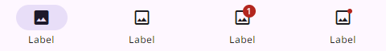
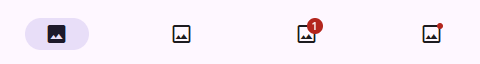

# MdNavigationBar (Navigation Bar)

> _Navigation bars let people switch between UI views on smaller devices_

- Use navigation bars in compact window sizes
- Can contain 3-5 destinations of equal importance
- Destinations don't change. They should be consistent across app screens.
- Used to be named bottom navigation

## Usage

Navigation bars (nav bars) provide access to three to five destinations. One navigation destination is always active.

The nav bar is positioned at the bottom of screens for convenient access. Each destination is represented by an icon and optional text label.

When a navigation bar icon is tapped or focused, the user is taken to the navigation destination associated with that icon.

Navigation bars should be used for:

- Top-level destinations that need to be accessible from anywhere in the app
- Three to five destinations
- Compact window sizes

Configurations:

- Label text with icon:

  

- Label text only:

  

## Properties

| Property | Type   | Default | Description                                          |
| -------- | ------ | ------- | ---------------------------------------------------- |
| type     | String | -       | Type of the navigation bar (constant: "drawer").     |
| position | String | -       | Position of the navigation bar (constant: "bottom"). |
| items    | String | -       | Items for the navigation bar.                        |

## Instance Methods

This component inherits methods from MdPanelComponent.

## Events

None

## Example

```html
<md-navigation-bar type="drawer" position="bottom" items="item1,item2,item3">
</md-navigation-bar>
```
