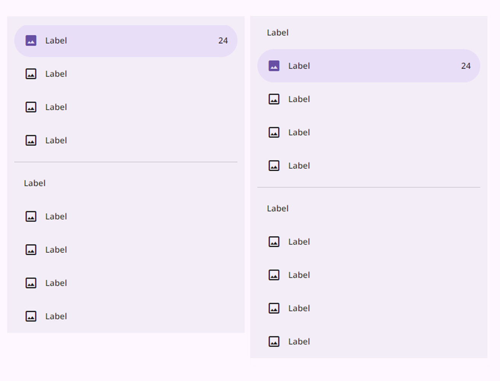
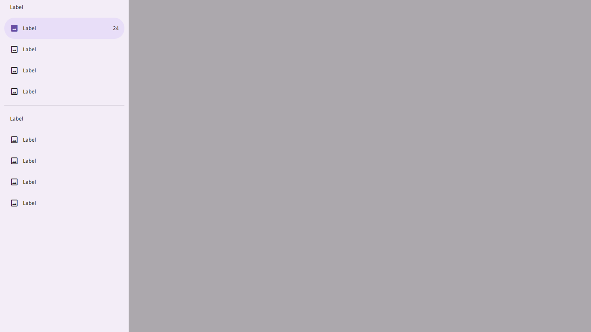

# MdNavigationDrawer (Navigation Drawer)

`MdNavigationDrawerComponent` is a custom element extending
`MdPanelComponent` to create a navigation drawer. It provides a panel with a list of items for navigation.

> _Navigation drawers let people switch between UI views on larger devices_

- Use standard navigation drawers in expanded, large, and extra large window sizes
- Use modal navigation drawers in compact and medium window sizes
- Can be open or closed by default
- Two types: standard and modal
- Put the most frequent destinations at the top and group related destinations together

## Usage

Navigation drawers provide access to destinations and app functionality, such as switching accounts. They can either be permanently on-screen or opened and closed by a navigation menu icon. One navigation destination is always active.

Navigation drawers are recommended for:

- Apps with 5 or more top-level destinations
- Apps with 2 or more levels of navigation hierarchy
- Quick navigation between unrelated destinations
- Replacing the navigation rail or navigation bar on large screens

Avoid using a navigation drawer with other primary navigation components, such as a navigation bar.

Instead, choose a single navigation component based on product requirements, breakpoints, and window size class:

- Navigation bars for compact window sizes
- Navigation rails for medium and expanded window sizes
- Standard navigation drawers for expanded, large, and extra-large window sizes

There are two types of navigation drawers:

`1` Standard navigation drawer, `2` Modal navigation drawer

### Configurations:

- Standard navigation drawer

  

- Modal drawer

  

## Properties

| Property | Type   | Default  | Description                                                 |
| -------- | ------ | -------- | ----------------------------------------------------------- |
| type     | String | "drawer" | Specifies the type of panel (fixed value: "drawer").        |
| position | String | "left"   | Specifies the position of the drawer (fixed value: "left"). |
| items    | String |          | Specifies the items for the navigation drawer.              |

_Default values are used if not provided explicitly._

## Instance Methods

None

## Events

None

## Example

`1` Standard navigation drawer

```html
<md-navigation-drawer
    .items="${[
        {leadingIcon:'image',label:"Label",activated:true,trailingSupportingText:'24'},
        {leadingIcon:'image',label:"Label"},
        {leadingIcon:'image',label:"Label",},
        {leadingIcon:'image',label:"Label",},
        {divider:true},
        {headline:'Label'},
        {leadingIcon:'image',label:"Label",},
        {leadingIcon:'image',label:"Label"},
        {leadingIcon:'image',label:"Label",},
        {leadingIcon:'image',label:"Label",},
    ]}"></md-navigation-drawer>
```

`2` Modal navigation drawer

```html

<md-button ui="filled-tonal" label="drawer modal" @click="${() => {drawer.modal=true;drawer.toggle()}}"></md-button>

<md-navigation-drawer style="width:360px;" id="drawer" ui="drawer" position="left"
    .items="${[
        {headline:'Label'},
        {leadingIcon:'image',label:"Label",activated:true,trailingSupportingText:'24'},
        {leadingIcon:'image',label:"Label"},
        {leadingIcon:'image',label:"Label",},
        {leadingIcon:'image',label:"Label",},
        {divider:true},
        {headline:'Label'},
        {leadingIcon:'image',label:"Label",},
        {leadingIcon:'image',label:"Label"},
        {leadingIcon:'image',label:"Label",},
        {leadingIcon:'image',label:"Label",},
    ]}"></md-navigation-drawer>


```
