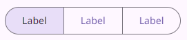
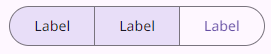

# MdSegmentedButtonComponent (Segmented Button)

`MdSegmentedButtonComponent` is a custom LitElement representing a material design segmented button.

> _Segmented button help people select options, switch views, or sort elements_

- Segmented buttons can contain icons, label text, or both
- Two types: single-select and multi-select
- Use for simple choices between two to five items (for more items or complex choices, use chips)

## Usage

Segmented buttons help people select options, switch views, or sort elements.

There are 2 types of segmented buttons:

`1` Single-select, `2` Mutli-select

- Single-select segmented button can only have 1 segment selected



- Multi-select segmented button can have multiple segments selected



## Properties

| Property | Type   | Default | Description                              |
| -------- | ------ | ------- | ---------------------------------------- |
| items    | Array  | [ ]     | An array of items for segmented buttons. |
| type     | String |         | The type of segmented button.            |

## Instance Methods

- `onSegmentedButtonClick(event:Event)`: Event handler for the segmented button click event. Toggles the activation state of the button(s) based on the type of segmented button.

## Events

- `onSegmentedButtonClick`: Fired when a segmented button is clicked.

## Examples

1. Single-select

   Use a single-select segmented button to select one option from a set, switch between views, or sort elements from up to five options.

```html
<md-segmented-button
  items='[
    {"label":"Label","activated":true},
    {"label":"Label"},
    {"label":"Label"}
    ]'
></md-segmented-button>
```

2. Mutli-select

   Use a multi-select segmented button to select or sort from two to five options. Unlike single-select, selection is not required and a user may concurrently select anywhere from all to none of the options.

```html
<md-segmented-button
  type="multi-select"
  items='[
    {"label":"Label","activated":true},
    {"label":"Label","activated":true},
    {"label":"Label"}
    ]'
></md-segmented-button>
```
